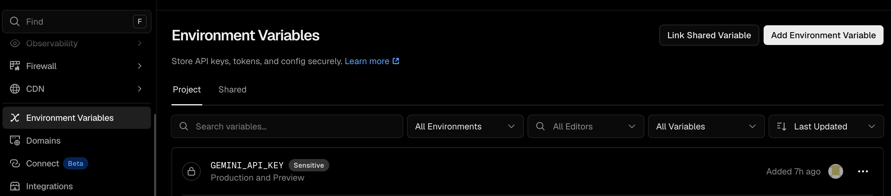

# Raindrop Feed

A personal, live Raindrop.io bookmark feed that anyone can clone and make their own. The Vite app runs alongside Vercel serverless functions, keeping each person's Raindrop credential on the server.

## How to use your feed

1. Save links with the [Raindrop browser extension or desktop app](https://raindrop.io/download), or use the [Raindrop mobile app](https://raindrop.io/download) while you are on your phone.
2. Open Raindrop Feed or use its refresh button to pull your latest Raindrop saves into this private view.
3. Switch between Day, Week, and Month to group bookmarks by when they were saved. Search looks through bookmark titles and labels.
4. Add an optional Gemini API key to use the **Label** actions beside time sections. They suggest labels for unlabeled bookmark cards, and every card also supports manual labels.
5. Open **Agent access** to create a private MCP connection URL. Add it to ChatGPT or Claude to search and discuss your library, or confirm label and collection changes from the chat.

The question-mark button in the feed header contains this same guide, so it stays out of the way while you are reading.

## Make it yours

### One-prompt setup

1. Clone or fork this repository and open it in Codex or Claude Code.
2. Say: `Set up this Raindrop Feed for me. I will sign in and provide keys when asked.`
3. Approve account sign-ins, enter your keys when asked, and approve the free Upstash Redis resource for permanent AI agent links.

The repository includes setup instructions that Codex and Claude Code discover automatically. The agent installs dependencies, creates or connects your own Vercel project, stores secrets server-side, deploys the app, and checks that anonymous access is blocked. It never needs the template author's Vercel project or credentials.

If your agent does not discover the workflow automatically, use `Use $setup-raindrop-feed to configure and deploy this clone.` in Codex or `/setup-raindrop-feed configure and deploy this clone.` in Claude Code.

### Get your keys

#### Raindrop token (required)

1. Open [Raindrop Integrations](https://app.raindrop.io/settings/integrations) and sign in.
2. Under **For developers**, select **+ Create new app** and complete the required app details.
3. Open the new app's settings and copy its **Test token**. A test token is designed for a personal app such as this one; you do not need OAuth.
4. Give the agent that token when it asks, or add it to Vercel with the exact key `RAINDROP_TOKEN`.

Do not use the Client ID or Client Secret. Keep the Test token private, just like a password.

#### Gemini API key (optional, enables automatic labels)

1. Open [Google's Gemini API key guide](https://ai.google.dev/gemini-api/docs/api-key).
2. Sign in to Google AI Studio, create or select a project, then create an API key.
3. Give the key to the agent when it asks, or add it to Vercel with the exact key `GEMINI_API_KEY`.

The feed works without Gemini. This key only enables the **Label** buttons.

#### App password (required)

Choose a long, unique password for your feed, or ask the agent to generate one. Add it with the exact key `APP_ACCESS_PASSWORD`. It is the password you will use to open your deployed site.

### Set up manually

1. Clone or fork this repository.
2. Deploy it to your own Vercel account.
3. In Vercel, open your project, then **Settings** > **Environment Variables** > **Add Environment Variable**. In **Key**, type the name below exactly; in **Value**, paste the matching token, key, or password.



| Key | Value | Required |
| --- | --- | --- |
| `RAINDROP_TOKEN` | Paste the Raindrop app's **Test token** | Yes |
| `APP_ACCESS_PASSWORD` | Paste a long, unique password that you choose | Yes |
| `GEMINI_API_KEY` | Paste your Gemini API key | Optional |

Select **Production**, **Preview**, and **Development** for each key you add. The agent provisions `UPSTASH_REDIS_REST_URL` and `UPSTASH_REDIS_REST_TOKEN` through Upstash; do not add those manually.

```bash
RAINDROP_TOKEN=your_raindrop_token_here
APP_ACCESS_PASSWORD=choose-a-long-unique-password
GEMINI_API_KEY=your_gemini_free_tier_key
```

`RAINDROP_TOKEN` and `APP_ACCESS_PASSWORD` are never exposed to the browser and must never be committed. The tracked `.env.example` contains no personal values; `.env*` and `.vercel` are ignored by Git.

## Private login

Set `APP_ACCESS_PASSWORD` to lock a deployment with a password screen. A successful sign-in creates a seven-day, signed HttpOnly cookie. Every route that can read or modify Raindrop data, including the AI endpoints, checks that session before responding.

Without `APP_ACCESS_PASSWORD`, the app remains open for simple personal previews. Set it in Vercel before sharing a production URL.

## Agent links

After signing in, select the agent icon in the feed header and create an agent link. It reveals a permanent private MCP URL that lets supported AI chat apps search and organize the current bookmark library without your browser cookie.

### ChatGPT connection

Pasting a URL into ChatGPT does not guarantee that its retrieval system will fetch it. The agent panel therefore displays a private MCP connection URL for using the library directly inside ChatGPT.

1. In ChatGPT, open **Settings**, then **Security and login**, and turn on **Developer mode**.
2. Open [ChatGPT Plugins](https://chatgpt.com/plugins), choose the plus button, create a connection using the private URL ending in `/mcp` from the agent panel, and choose **No Auth**.
3. Start a new chat, add that connection from the tools menu, and ask about your bookmarks.

The connection exposes search, bookmark details, tags, collections, tag updates, and moves to existing collections. It does not expose deletion. It uses the same revocable agent key as the ordinary agent page, so revoking the link immediately disconnects ChatGPT as well. Developer mode availability depends on the ChatGPT account and workspace policy.

Each link is separately revocable from the same panel. The full secret is displayed only when the link is created, so keep it in the conversation or password manager that needs it. Treat it like a password: anyone who has it can read the library and make the limited changes listed below.

An agent link can:

- Read paginated bookmarks, full records, tags, and collection names.
- Add or remove bookmark tags.
- Move a bookmark into an existing collection.

It cannot delete bookmarks, empty Trash, create collections, or change the Raindrop account. Every key is rate-limited and retains its 50 most recent requests in the signed-in activity view.

Permanent agent links use [Upstash Redis](https://upstash.com/) through the Vercel Marketplace. When cloning this template, add **Upstash for Redis** to the Vercel project before creating a link; Vercel automatically supplies its server-side connection variables. `APP_ACCESS_PASSWORD` is required before the app will create any agent link.

## AI labels

Set `GEMINI_API_KEY` to enable the in-feed labeler. Each Day, Week, or Month heading shows a `Label` action when it contains bookmarks with no labels (apart from the built-in `read` marker). Selecting it adds 2 to 6 useful labels to every unlabeled bookmark in that section.

The labeler sends the selected bookmark's title, URL, domain, excerpt, note, and existing tags to Gemini. It uses Gemini 3.1 Flash-Lite with a fallback to Gemini 2.5 Flash-Lite. It does not scrape the linked page or send the rest of your library. Gemini's free tier has usage limits and may use submitted content to improve its products; review [Google's Gemini API pricing and data terms](https://ai.google.dev/gemini-api/docs/pricing) before enabling it.

## Local development

```bash
npm install
npm run build
npx vercel dev
```

Use an ignored `.env.local` file for local values. Vite alone does not run the serverless routes.

## Deploy

```bash
npx vercel deploy
npx vercel deploy --prod
```
